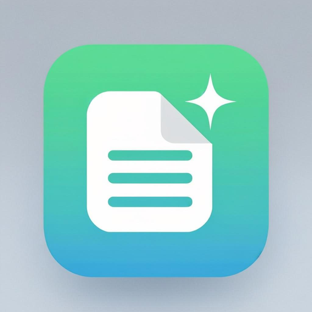
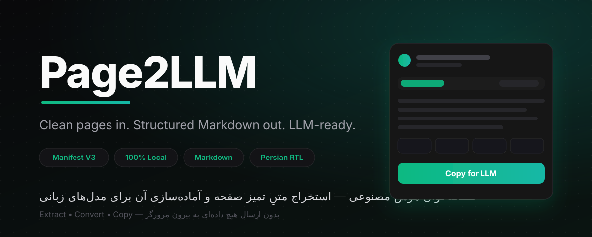
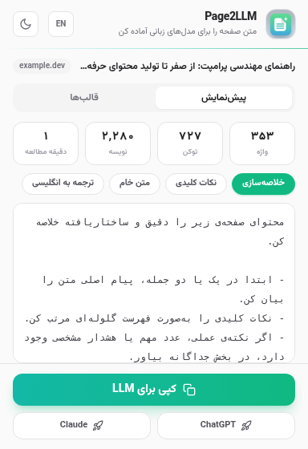
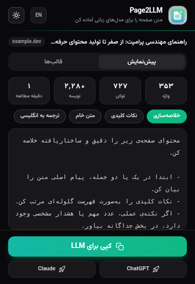
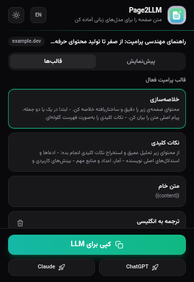

<div align="center">
  

  # Page2LLM — صفحه‌خوان هوش مصنوعی

  <p dir="rtl">
    <b>فارسی:</b> استخراج متنِ تمیز و ساختاریافته از هر صفحه وب، تبدیل به مارک‌داون استاندارد و آماده‌سازی برای مدل‌های زبانی — کاملاً محلی، بدون ارسال هیچ داده‌ای.<br/>
    <b>English:</b> Extract clean, structured text from any web page, convert it to standard Markdown and make it LLM-ready — 100% local, no data leaves your browser.
  </p>

  
  
  
  
  
  

  
</div>

---

<div dir="rtl">

## درباره‌ی پروژه

**Page2LLM** یک افزونه‌ی سبک و متن‌باز کروم (Manifest V3) است که با یک کلیک، محتوای اصلی صفحه‌ی فعال را از بنرها، تبلیغات، نوبارها و کامنت‌ها جدا می‌کند، آن را به مارک‌داون استاندارد تبدیل می‌کند و همراه با پرامپت آماده، در کلیپ‌بورد شما قرار می‌دهد.

- بدون حساب کاربری، بدون سرور واسط، بدون تحلیلگر (Analytics)
- رابط کاربری دوزبانه (فارسی/انگلیسی) با پشتیبانی کامل RTL
- طراحی مینیمال با پوسته‌ی روشن و تیره

## ویژگی‌ها

- **استخراج هوشمند** — تشخیص بدنه‌ی اصلی مقاله با `@mozilla/readability`؛ استخراج عنوان، نویسنده، تاریخ انتشار، نام سایت و منبع.
- **تبدیل به مارک‌داون** — خروجی تمیز با پشتیبانی از جدول‌ها، بلوک‌های کد (حتی با زبان)، لیست‌ها، نقل‌قول‌ها و لینک‌ها از طریق Turndown + GFM.
- **شمارش توکن تخمینی** — نمایش تعداد واژه، توکن (هیوریستیک جداگانه برای فارسی/عربی/CJK/لاتین)، نویسه و زمان مطالعه؛ پیش از ارسال به LLM.
- **قالب‌های پرامپت آماده** — «خلاصه‌سازی»، «نکات کلیدی»، «متن خام» + امکان ساخت قالب دلخواه با جایگاه‌نگهدار `{{content}}` و ذخیره در `chrome.storage.local`.
- **اقدام سریع** — کپی با یک کلیک همراه با بازخورد Toast، یا ارسال مستقیم به ChatGPT / Claude (کپی خودکار + باز شدن تب).
- **پوسته روشن/تیره** — هم‌گام با سیستم یا انتخاب دستی؛ زبان UI فارسی یا انگلیسی.
- **میان‌بر کیبورد** — باز شدن پاپ‌آپ با `Alt+Shift+P`.

## پیش‌نمایش

| پیش‌نمایش (روشن) | پیش‌نمایش (تیره) | قالب‌های پرامپت |
| :---: | :---: | :---: |
|  |  |  |

## نصب

### روش ۱: دانلود از Releases (پیشنهادی)

1. آخرین نسخه را از صفحه‌ی [Releases](https://github.com/SamRonin/Page2LLM/releases/latest) دانلود کنید (`page2llm-vX.Y.Z-chrome.zip`).
2. فایل را از حالت فشرده خارج کنید — پوشه‌ای با نام `Page2LLM` به دست می‌آید.
3. در کروم به `chrome://extensions` بروید.
4. گوشه‌ی بالا-راست **Developer mode** را روشن کنید.
5. روی **Load unpacked** کلیک کنید و پوشه‌ی `Page2LLM` را انتخاب کنید.
6. آیکون Page2LLM در نوار افزونه‌ها ظاهر می‌شود (در صورت مخفی بودن، روی آیکون پازل کلیک و آن را Pin کنید).

### روش ۲: ساخت از سورس

```bash
git clone https://github.com/SamRonin/Page2LLM.git
cd Page2LLM
bun install        # یا: npm install
bun run build      # یا: npm run build
```

سپس پوشه‌ی `dist/` را مطابق مراحل ۳ تا ۵ روش اول Load unpacked کنید.

## استفاده

1. صفحه‌ی موردنظر را باز کنید و روی آیکون افزونه کلیک کنید (یا `Alt+Shift+P`).
2. چند لحظه صبر کنید تا متن استخراج و پیش‌نمایش مارک‌داون نمایش داده شود.
3. از نوار «قالب» یکی از گزینه‌ها را انتخاب کنید:
   - **خلاصه‌سازی** — پرامپت آماده‌ی خلاصه‌سازی ساختاریافته.
   - **نکات کلیدی** — استخراج ادعاها، آمار، بینش‌ها و نقاط ضعف.
   - **متن خام** — فقط مارک‌داون، بدون پرامپت.
   - **قالب دلخواه** — قالب‌های خودتان از تب «قالب‌ها».
4. روی **کپی برای LLM** بزنید و در ChatGPT، Claude یا هر مدل دیگری Paste کنید.
5. یا مستقیم از دکمه‌های **ChatGPT / Claude** استفاده کنید؛ محتوا کپی و تب مدل باز می‌شود — کافی است `Ctrl+V` بزنید.

نکته: تب «قالب‌ها» شامل گزینه‌های خروجی (درج اطلاعات صفحه، حذف تصاویر) و فرم ساخت قالب دلخواه با جایگاه `{{content}}` است.

## معماری و ساختار پروژه

```text
page2llm/
├── public/
│   ├── manifest.json          # Manifest V3 — حداقل دسترسی‌ها
│   └── icons/                 # آیکون‌های 16/32/48/128
├── src/
│   ├── background/
│   │   └── service-worker.ts  # مقداردهی اولیه + مدیریت پیام‌ها
│   ├── content/
│   │   └── extractor.ts       # Readability → JSON (بدون هیچ وابستگی خارجی در اجرا)
│   ├── popup/
│   │   ├── popup.html         # مارک‌آپ پاپ‌آپ
│   │   ├── popup.css          # Tailwind + استایل‌های سفارشی
│   │   └── popup.ts           # منطق UI، کپی، قالب‌ها، تنظیمات
│   ├── utils/
│   │   ├── markdown.ts        # HTML → Markdown (Turndown + GFM)
│   │   ├── tokens.ts          # شمارش واژه/توکن تخمینی
│   │   ├── i18n.ts            # دیکشنری fa/en + اعمال RTL/LTR
│   │   ├── presets.ts         # قالب‌های آماده و دلخواه
│   │   ├── storage.ts         # پوشش chrome.storage.local
│   │   └── types.ts           # تایپ‌های مشترک
│   └── demo/sample.ts         # داده‌ی نمونه برای حالت دمو
├── vite.config.ts
├── tailwind.config.ts
└── package.json
```

**جریان داده:** پاپ‌آپ با `chrome.scripting.executeScript` اسکریپت استخراج را به تب فعال تزریق می‌کند ← اکسترکتور با `@mozilla/readability` بدنه‌ی اصلی را جدا و نتیجه را با `chrome.runtime.sendMessage` برمی‌گرداند ← پاپ‌آپ HTML را با Turndown به مارک‌داون تبدیل، پرامپت قالب را اعمال و آماده‌ی کپی می‌کند.

## مجوزها و حریم خصوصی

| مجوز | دلیل |
| :--- | :--- |
| `activeTab` | دسترسی موقت فقط به تب فعال، تنها وقتی شما روی افزونه کلیک کنید |
| `scripting` | تزریق اسکریپت استخراج به تب فعال |
| `storage` | ذخیره‌ی محلی تنظیمات و قالب‌های دلخواه |
| `clipboardWrite` | کپی خروجی در کلیپ‌بورد |

- هیچ داده‌ای به هیچ سروری ارسال نمی‌شود؛ هیچ تحلیلگری وجود ندارد؛ هیچ درخواست شبکه‌ای از سمت افزونه صادر نمی‌شود.
- کل کد متن‌باز است و می‌توانید آن را بازبینی کنید.
- دکمه‌های ChatGPT / Claude فقط محتوا را در کلیپ‌بورد کپی و وب‌سایت مدل را باز می‌کنند.

## توسعه

| دستور | کار |
| :--- | :--- |
| `bun run dev` | بیلد با watch برای توسعه |
| `bun run build` | بیلد نهایی در `dist/` |
| `bun run typecheck` | بررسی تایپ‌ها با TypeScript Strict |
| `bun run preview` | پیش‌نمایش پاپ‌آپ در مرورگر (حالت دمو) |

**پشته:** TypeScript 5 · Vite 5 · Tailwind CSS 3 · Vazirmatn · @mozilla/readability · Turndown (+GFM)

## مشارکت

مشارکت‌ها خوش‌آمدند! لطفاً [CONTRIBUTING.md](CONTRIBUTING.md) را بخوانید. ایده‌های خوب برای شروع: افزودن قالب‌های پرامپت جدید، ترجمه‌ها، و بهبود استخراج توکن.

## مجوز

منتشرشده تحت [مجوز MIT](LICENSE).
</div>

---

<div dir="ltr">

## About

**Page2LLM** is a lightweight, open-source Chrome extension (Manifest V3) that separates the main content of the active page from banners, ads, navbars and comments with one click, converts it to standard Markdown, and puts it on your clipboard together with a ready-made prompt.

- No accounts, no middle-man servers, no analytics
- Bilingual UI (Persian/English) with full RTL support
- Minimal design with light & dark themes

## Features

- **Smart extraction** — detects the article body with `@mozilla/readability`; grabs title, author, publish date, site name and source URL.
- **Markdown conversion** — clean output with tables, fenced code blocks (language preserved), lists, quotes and links via Turndown + GFM.
- **Estimated token counting** — words, tokens (separate heuristics for Persian/Arabic, CJK and Latin), characters and reading time, before you hit the LLM.
- **Prompt presets** — Summarize, Key insights, Raw Markdown, plus custom presets with a `{{content}}` placeholder stored in `chrome.storage.local`.
- **Quick actions** — one-click copy with toast feedback, or send straight to ChatGPT / Claude (auto-copy + tab opens).
- **Light/Dark themes** — synced with the system or manual; Persian or English UI.
- **Keyboard shortcut** — open the popup with `Alt+Shift+P`.

## Screenshot

| Preview (light) | Preview (dark) | Presets |
| :---: | :---: | :---: |
|  |  |  |

## Installation

**Option 1 — from Releases:** grab `page2llm-vX.Y.Z-chrome.zip` from [Releases](https://github.com/SamRonin/Page2LLM/releases/latest), unzip it (you get a `Page2LLM` folder), open `chrome://extensions`, enable **Developer mode**, click **Load unpacked** and select the `Page2LLM` folder.

**Option 2 — from source:**

```bash
git clone https://github.com/SamRonin/Page2LLM.git
cd Page2LLM
bun install        # or: npm install
bun run build      # or: npm run build
```

Then load the `dist/` folder via **Load unpacked**.

## Usage

1. Open any page and click the extension icon (or press `Alt+Shift+P`).
2. Wait a moment for extraction; the Markdown preview appears.
3. Pick a preset: **Summarize**, **Key insights**, **Raw Markdown**, or one of your custom presets.
4. Click **Copy for LLM** and paste into ChatGPT, Claude or any model.
5. Or use the **ChatGPT / Claude** buttons: the content is copied and the model's site opens — just press `Ctrl+V`.

The **Presets** tab also holds output options (include page info, strip images) and the custom-preset form using the `{{content}}` placeholder.

## Permissions & Privacy

| Permission | Why |
| :--- | :--- |
| `activeTab` | Temporary access to the active tab, only when you click the extension |
| `scripting` | Injects the extractor into the active tab |
| `storage` | Saves settings and custom presets locally |
| `clipboardWrite` | Copies the output to your clipboard |

No data ever leaves your browser. No analytics, no network requests from the extension itself. The ChatGPT / Claude buttons only copy content to the clipboard and open the model's website.

## Development

| Script | Purpose |
| :--- | :--- |
| `bun run dev` | Watch-mode build for development |
| `bun run build` | Production build into `dist/` |
| `bun run typecheck` | Strict TypeScript check |
| `bun run preview` | Preview the popup in a browser (demo mode) |

**Stack:** TypeScript 5 · Vite 5 · Tailwind CSS 3 · Vazirmatn · @mozilla/readability · Turndown (+GFM)

## Contributing

Contributions are welcome! Please read [CONTRIBUTING.md](CONTRIBUTING.md). Good first issues: new prompt presets, translations, and improved token estimation.

## License

Released under the [MIT License](LICENSE).
</div>
